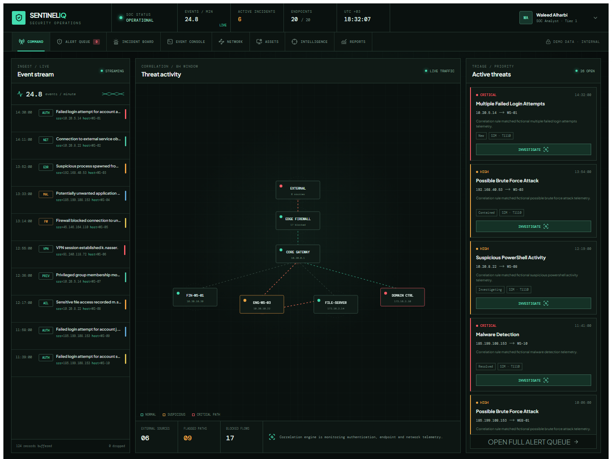
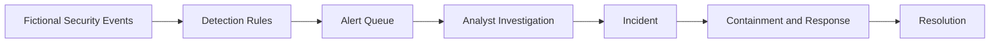
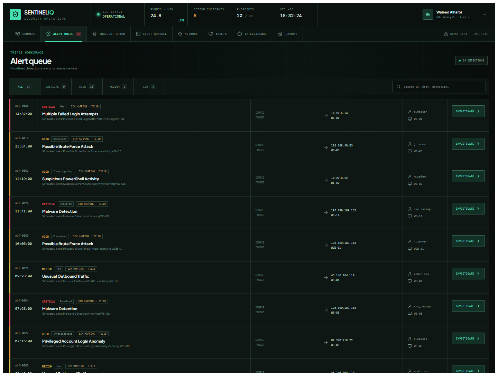
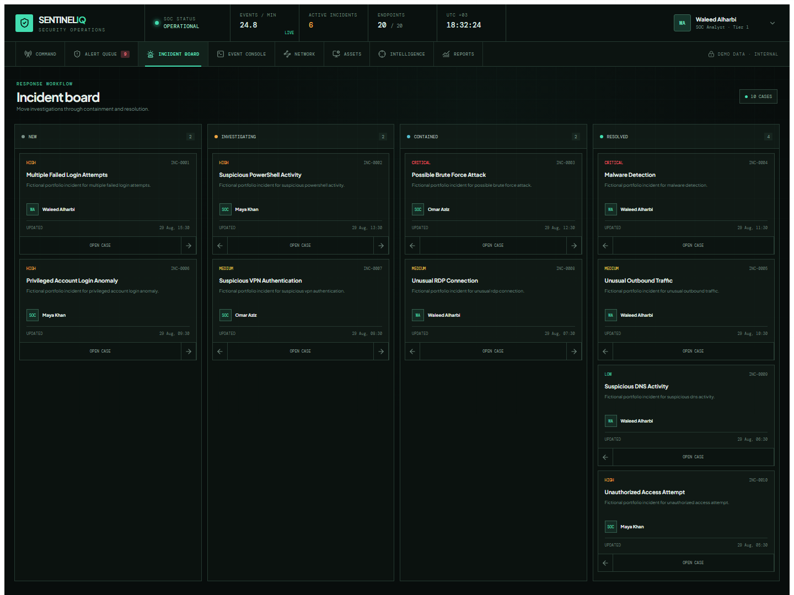
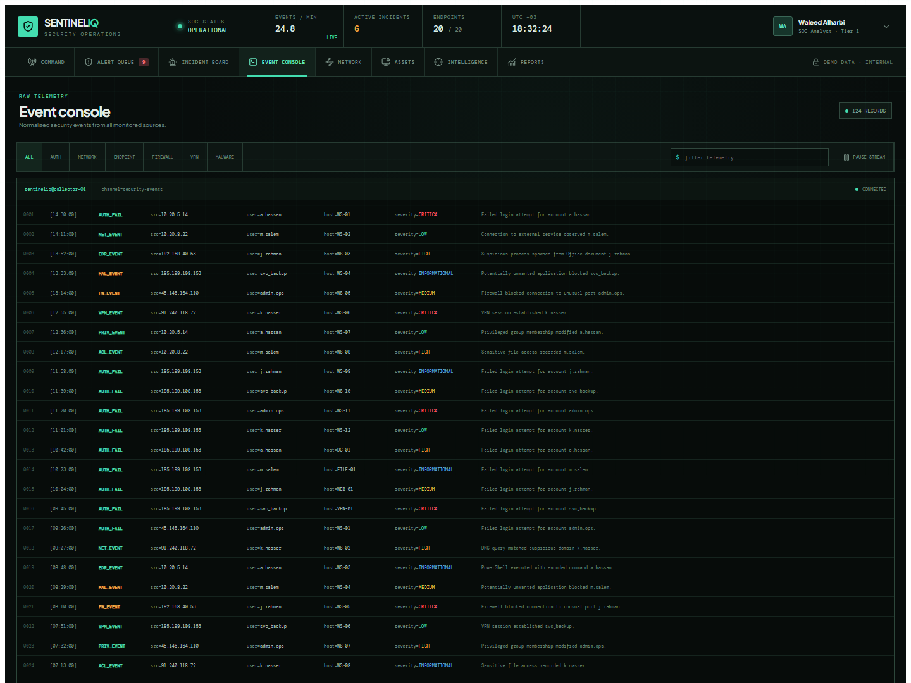
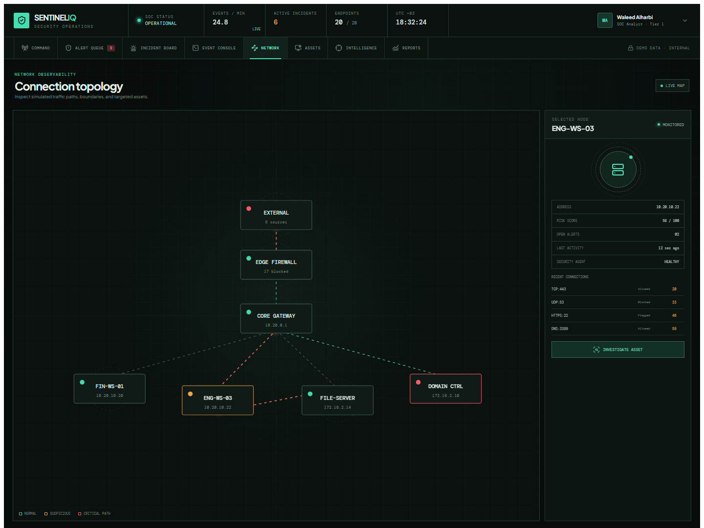
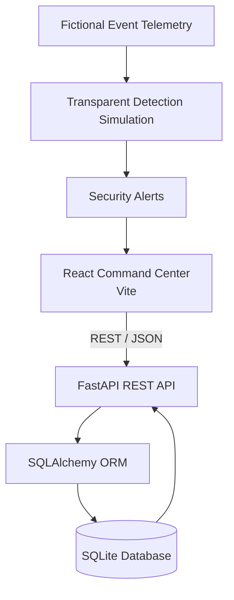

# SOC Security Monitoring Dashboard

<p align="center">
  A simulated Security Operations Center portfolio project built with React, FastAPI, and SQLite, demonstrating security monitoring, alert triage, incident response, network analysis, endpoint monitoring, and threat intelligence workflows.
</p>

<p align="center">
  
  
  
  
  
  
  
  
</p>

> [!IMPORTANT]
> This application uses fictional, simulated security data for portfolio and educational purposes. It is not a production SIEM, does not consume real threat feeds, and does not claim real-world malware detection or MITRE ATT&CK integration.

## Project Preview

<p align="center">
  
</p>

## Overview

SentinelIQ models a junior SOC analyst workflow in a safe local environment. Instead of a conventional admin dashboard, the interface is structured as a dense operations workstation with a live event stream, an abstract network topology, an actionable alert queue, an investigation timeline, and an incident response board.

The frontend consumes a documented FastAPI REST API backed by SQLAlchemy and an automatically seeded SQLite database.

## Key Features

- **Security Operations Command Center** with live operational status and analyst context
- **Live Security Event Stream** rotating through existing fictional telemetry
- **SOC Alert Queue** with severity, source, target, status, and simulated technique labels
- **Incident Investigation** drawer with evidence, related context, and a correlated timeline
- **Analyst Response Actions** for acknowledge, investigate, contain, escalate, and resolve
- **Incident Response Board** organized by New, Investigating, Contained, and Resolved stages
- **Interactive Network Topology** showing monitored boundaries, nodes, and suspicious paths
- **Terminal-Style Event Console** with authentication, network, endpoint, firewall, VPN, and malware filters
- **Endpoint Monitoring**, suspicious IP context, and fictional threat indicators
- **Rule-Based Detection Simulation** for authentication, endpoint, malware, and network scenarios

## SOC Workflow



## Screenshots

| Command Center | Alert Queue |
| --- | --- |
|  |  |

| Incident Board | Event Console |
| --- | --- |
|  |  |

### Network Topology



## Technology Stack

| Layer | Technology |
| --- | --- |
| Frontend | React, Vite, JavaScript, Recharts, Lucide React, CSS |
| Backend | Python, FastAPI, SQLAlchemy, Pydantic |
| Database | SQLite |
| API | REST, JSON, OpenAPI/Swagger |
| Tooling | Git, GitHub, Docker Compose |

## System Architecture



## Detection Logic

The backend includes deliberately simple and readable simulation rules for scenarios such as:

- repeated failed logins from the same source IP;
- multiple failures targeting an account;
- unusual VPN authentication or privileged activity;
- suspicious PowerShell execution;
- malware-related endpoint telemetry;
- high-volume outbound traffic and unusual port activity.

Technique labels shown in the interface are **educational simulated mappings only**. They do not represent a real MITRE ATT&CK integration.

## API Endpoints

Interactive documentation is available at `http://127.0.0.1:8000/docs` while the backend is running.

| Method | Endpoint | Purpose |
| --- | --- | --- |
| `GET` | `/api/health` | Service health |
| `GET` | `/api/dashboard/stats` | Command-center summary |
| `GET` | `/api/events` | List security events |
| `GET` | `/api/events/{id}` | Retrieve an event |
| `GET` | `/api/alerts` | List alerts |
| `GET` | `/api/alerts/{id}` | Retrieve an alert |
| `POST` | `/api/alerts` | Create an alert |
| `PUT` | `/api/alerts/{id}` | Update an alert |
| `GET` | `/api/incidents` | List incidents |
| `GET` | `/api/incidents/{id}` | Retrieve an incident |
| `POST` | `/api/incidents` | Create an incident |
| `PUT` | `/api/incidents/{id}` | Update an incident workflow state |
| `GET` | `/api/endpoints` | List monitored endpoints |
| `GET` | `/api/network/events` | List network events |
| `GET` | `/api/threat-intelligence` | List fictional threat indicators |
| `GET` | `/api/reports/summary` | Retrieve reporting data |

## Demo Data

The local database is generated automatically and currently seeds:

| Dataset | Verified records |
| --- | ---: |
| Security events | 124 |
| Security alerts | 34 |
| Incidents | 10 |
| Endpoints | 20 |
| Network events | 50 |
| Threat indicators | 20 |

All usernames, hosts, IP activity, alerts, incidents, and indicators are fictional.

## Project Structure

```text
soc-security-monitoring-dashboard/
├── backend/
│   ├── app/
│   │   ├── database.py
│   │   ├── main.py
│   │   ├── models.py
│   │   ├── schemas.py
│   │   └── seed.py
│   ├── Dockerfile
│   └── requirements.txt
├── frontend/
│   ├── src/
│   │   ├── CommandCenterApp.jsx
│   │   ├── command-center-v2.css
│   │   └── entry.jsx
│   ├── Dockerfile
│   └── package.json
├── screenshots/
├── docker-compose.yml
└── README.md
```

## Getting Started

Requirements:

- Python 3.11 or newer
- Node.js 20 or newer
- npm

Clone the repository, then run the backend and frontend in separate terminals.

## Running Backend

```powershell
cd backend
python -m venv .venv
.\.venv\Scripts\Activate.ps1
python -m pip install -r requirements.txt
python -m uvicorn app.main:app --reload --port 8000
```

The first startup creates and seeds `backend/soc_dashboard.db`. The database file is excluded from Git.

## Running Frontend

```powershell
cd frontend
npm.cmd install
npm.cmd run dev
```

Open the exact local URL printed by Vite, normally `http://localhost:5173`.

## Docker

```bash
docker compose up --build
```

Frontend: `http://localhost:5173`

API documentation: `http://localhost:8000/docs`

## Security Concepts Demonstrated

- Security event monitoring and authentication monitoring
- Alert triage and severity classification
- Incident investigation, containment, escalation, and resolution
- Endpoint and network monitoring
- IOC analysis and suspicious IP monitoring
- Brute-force and suspicious PowerShell detection simulations
- Security operations workflows and analyst handoffs

## Skills Demonstrated

- React interface architecture and state management
- FastAPI REST API development and OpenAPI documentation
- SQLAlchemy modeling and SQLite persistence
- Security-focused data visualization and workflow design
- Responsive CSS and accessible interaction patterns
- Git, Docker, project documentation, and portfolio presentation

## Future Improvements

- Authentication and role-based analyst access
- Persistent alert-to-incident linking and audit history
- WebSocket-based event streaming
- Pagination and server-side date-range filtering
- Exportable PDF or CSV reports
- Automated frontend and backend test suites

## Portfolio Purpose

This project demonstrates foundational SOC concepts and full-stack development skills in a fictional local environment. It should be evaluated as a portfolio simulation, not as an enterprise security product or production detection system.

## Author

**Waleed Alharbi**

[GitHub Profile](https://github.com/Waleed-Alharbi)
